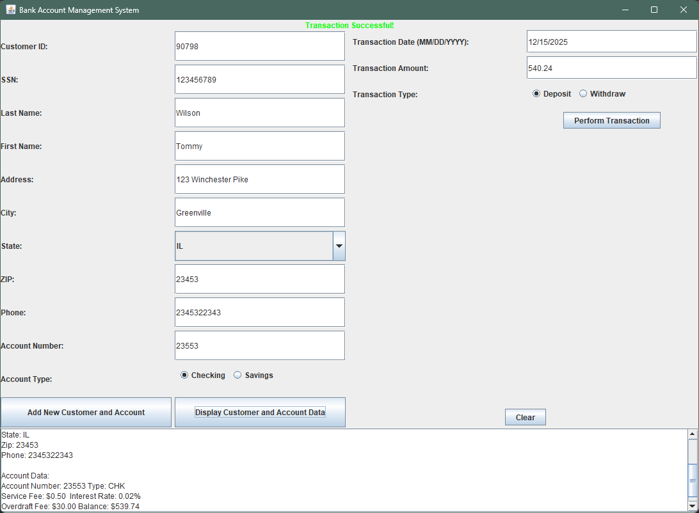

# BankAcctApp

A Java-based banking application that allows users to manage customer accounts, perform transactions, and view detailed account information with full input validation and error handling.

---

## Screenshots / Walkthrough

### 1. Add Customer Form
  
*Figure 1: Enter customer and account information including Customer ID, SSN, Name, Address, Account Number, and Account Type.*

---

### 2. Error Handling – Customer/Account
  
*Figure 2: Validation error displayed when required fields are missing or invalid.*

---

### 3. Successful Customer/Account Creation
  
*Figure 3: Confirmation message after successfully adding a customer and account.*

---

### 4. Transaction Input
  
*Figure 4: Enter transaction details including date, amount, and type (Deposit/Withdrawal).*

---

### 5. Transaction Error
  
*Figure 5: Error displayed when transaction input is invalid or missing.*

---

### 6. Successful Transaction
  
*Figure 6: Confirmation message and transaction details displayed after a successful transaction.*

---

### 7. Display Customer/Account Data
  
*Figure 7: View all customer information, account types, balances, interest rates, and service fees.*
